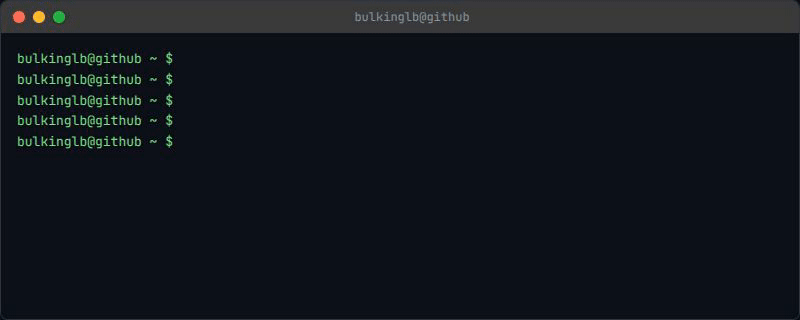
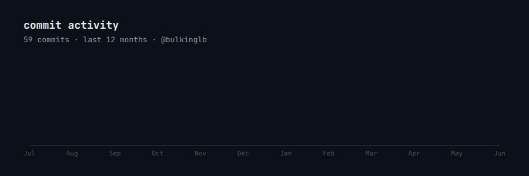
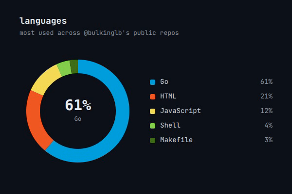

# readme-frames

Animated GIFs for GitHub profile READMEs, rendered with [HyperFrames](https://github.com/heygen-com/hyperframes).

Fork → edit one config file → render → embed. Five compositions ship out of the box.








---

## Compositions

| Folder | Dimensions | What it does |
|------|-----------|--------------|
| `compositions/intro-card/` | 1280 × 240 | Name fades in, role types out |
| `compositions/skills-ticker/` | 1920 × 120 | Infinite-scrolling tech stack marquee |
| `compositions/terminal/` | 800 × 320 | Fake terminal that types your story |
| `compositions/commit-chart/` | 900 × 300 | Monthly commit activity across your repos, area chart live from the GitHub API |
| `compositions/lang-donut/` | 600 × 400 | Most-used languages across your repos, donut chart live from the GitHub API |

---

## Coming soon

| Idea | Dimensions | Notes |
|------|-----------|-------|
| Project spotlight reel | 1280 × 480 | One slide per pinned repo |
| Live streak counter | 900 × 200 | Numbers count up from zero |
| Contribution timeline | 1280 × 200 | Horizontal dot-per-month |

PRs welcome.

---

## Quick start

**Requirements:** Node.js ≥ 22, FFmpeg, [HyperFrames](https://hyperframes.heygen.com) (`npm install -g hyperframes`)

Each composition is its own project folder with an `index.html` entry point — `config.js` gets copied alongside it before rendering so Chrome can load it without hitting `file://` path restrictions:

```bash
git clone https://github.com/bulkinglb/readme-frames
cd readme-frames

cp config.js compositions/terminal/config.js
cd compositions/terminal
hyperframes render --fps 60 --output ../../assets/terminal.mp4
cd ../..

ffmpeg -y -i assets/terminal.mp4 \
  -vf "fps=30,scale=800:-1:flags=lanczos,split[s0][s1];[s0]palettegen[p];[s1][p]paletteuse" \
  -loop 0 assets/terminal.gif
```

Repeat for `intro-card`, `skills-ticker`, `commit-chart`, and `lang-donut` (see `.github/workflows/render-readme.yml` for the exact commands used in CI) — or just push and let the Action do it for you.

> **commit-chart** and **lang-donut** each need one extra step first — `node scripts/fetch-commit-data.js` and `node scripts/fetch-language-data.js` aggregate your GitHub activity into the composition's `data.js` before rendering. Set `GITHUB_TOKEN` to avoid the unauthenticated rate limit (CI does this automatically).

---

## Personalising

**Edit one file: `config.js`** — every composition reads from it automatically.

```js
const CONFIG = {

  // who you are
  username: 'yourname',
  hostname: 'github',       // shows as  yourname@github ~ $

  // terminal script — types: cmd | out | success | error | info
  lines: [
    { type: 'cmd',     text: 'whoami' },
    { type: 'out',     text: 'yourname — your role' },
    { type: 'cmd',     text: 'echo $QUOTE' },
    { type: 'success', text: 'your favourite quote' },
  ],

  typingSpeed:    55,   // ms per character
  pauseAfterLine: 800,  // ms before the next prompt appears

  // intro card
  introName: 'yourname',
  introRole: 'your role — your tagline',
  nameFadeDuration: 0.9,
  roleTypingSpeed:  60,

  // skills ticker
  scrollDuration: 40,   // seconds per loop — lower = faster

  icons: [
    { slug: 'typescript', label: 'TypeScript' },
    { slug: 'react',      label: 'React' },
    // find slugs at https://simpleicons.org
  ],

  // commit activity chart — monthly totals across all your public repos,
  // pulled live from the GitHub REST API (no auth needed)
  commitChart: {
    months: 12,
    color: '#7ee787',
  },

  // language donut — language bytes aggregated across all your public repos
  langDonut: {
    top: 6,   // languages to show, rest grouped as "Other"
  },
};
```

Line types and their colours:

| Type | Colour |
|------|--------|
| `cmd` | white — typed char by char |
| `out` | white — appears at 40% typing speed |
| `success` | green `#7ee787` |
| `error` | red `#f78166` |
| `info` | blue `#79c0ff` |

Icon slugs come from [Simple Icons](https://simpleicons.org) — hover any icon on that site to see the slug (e.g. `nextdotjs`, `nodedotjs`, `amazonaws`).

---

## Embedding in your profile README

After forking, the Action will render and commit the GIFs to your fork's `assets/` folder. Then add these to your `username/username` README, swapping in your GitHub username:

```md


```

The `raw.githubusercontent.com` URL always serves the latest committed GIF straight from your fork — no copying files, no manual updates.

---

## Automated rendering (GitHub Actions)

The included workflow (`.github/workflows/render-readme.yml`) re-renders both GIFs and commits them automatically on every push to `compositions/` — so you never run the render command manually again.

It's already configured. Just push this repo and GitHub Actions handles the rest.

---

## Credits

Built with [HyperFrames](https://github.com/heygen-com/hyperframes) by HeyGen.  
Icons from [Simple Icons](https://simpleicons.org).
